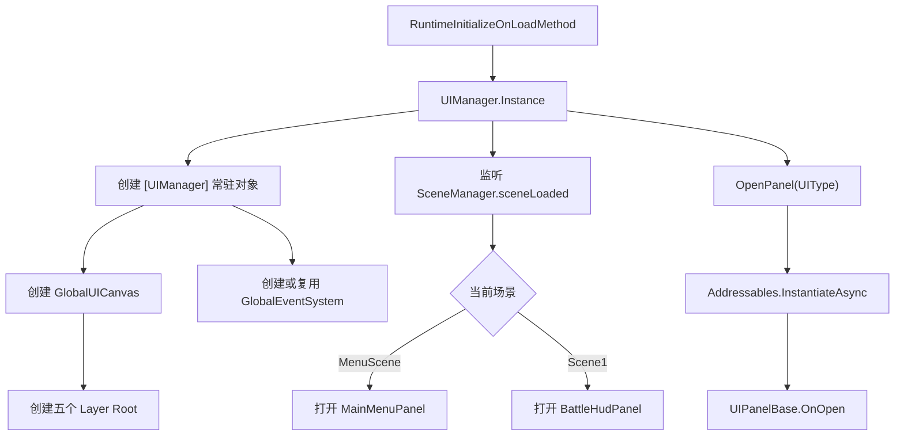

# UI 系统框架设计文档

## 1. 目标与范围

本文档说明 FirstGameDemo 第一版 UI 系统的框架设计、运行流程、面板开发规范和后续扩展方式。当前 UI 系统面向 Unity 2022.3.61f1c1，使用 UGUI + TextMeshPro，不引入 UI Toolkit。

第一版目标是先建立可运行、可扩展的 UI 骨架，而不是完成最终美术表现或完整战斗数据接入。

已覆盖能力：

- 全局常驻 UI 根节点。
- 自动创建和维护 `Canvas`、`CanvasScaler`、`GraphicRaycaster`。
- 自动创建和去重 `EventSystem`。
- 固定 UI 分层。
- Addressables 面板预制体加载。
- 面板实例缓存和统一打开/关闭入口。
- 主菜单、战斗 HUD、暂停、设置、确认弹窗、加载遮罩、Toast。
- 菜单场景与战斗场景的自动 UI 切换。
- `Esc` 暂停/恢复。
- 基础设置持久化：主音量、全屏。

暂不包含：

- 玩家血量、体力、技能冷却、伤害数字等真实战斗数据接入。
- 敌人血条、锁定目标 UI、装备/背包/技能树等功能型窗口。
- 美术最终风格、动画、音效和复杂交互。

## 2. 文件结构

核心代码位于 `Assets/Game/UI/`。

```text
Assets/Game/UI/
├── UIManager.cs              # 全局 UI 管理器，负责根节点、分层、面板生命周期、场景流程
├── UIPanelBase.cs            # 所有 UI 面板基类
├── UIPanelAttribute.cs       # 面板自动注册特性
├── UIShortcutAttribute.cs    # 面板快捷键注册特性
├── UIType.cs                 # 面板类型枚举
├── UILayer.cs                # UI 层级枚举
├── UIConfirmData.cs          # 确认弹窗传入数据
├── UIElementFactory.cs       # 运行时创建 UGUI 控件的辅助类
├── MainMenuPanel.cs          # 主菜单
├── BattleHudPanel.cs         # 战斗 HUD 静态展示
├── PausePanel.cs             # 暂停菜单
├── SettingsPanel.cs          # 设置面板
├── ConfirmDialogPanel.cs     # 确认弹窗
├── LoadingPanel.cs           # 加载遮罩
├── ToastPanel.cs             # 顶部提示
└── Prefabs/                  # 由 puerts MCP 生成的 UGUI 面板预制体
```

历史测试脚本 `TestUI.cs`、`test.cs` 保留，但新 UI 系统不依赖它们。

## 3. 总体架构

UI 系统采用“全局管理器 + 面板基类 + Addressables 预制体 + 运行时兜底”的结构。



关键设计点：

- `UIManager` 不继承项目已有 `SingletonManager<T>`，使用独立静态实例，避免现有单例基类 `Awake` 生命周期和派生类隐藏问题。
- UI 根节点通过 `[RuntimeInitializeOnLoadMethod(RuntimeInitializeLoadType.BeforeSceneLoad)]` 自动启动，不依赖场景手动摆放。
- 面板默认从 Addressables 加载，如果加载失败，则创建运行时兜底面板，保证开发阶段不因资源缺失完全卡死。
- 所有面板都继承 `UIPanelBase`，面板显示/隐藏统一走 `OnOpen`、`OnClose`。

## 4. UIManager 生命周期

### 4.1 启动

启动入口：

```csharp
[RuntimeInitializeOnLoadMethod(RuntimeInitializeLoadType.BeforeSceneLoad)]
private static void Bootstrap()
{
    _ = Instance;
}
```

执行顺序：

1. 创建或查找 `[UIManager]`。
2. `DontDestroyOnLoad(gameObject)` 保持跨场景常驻。
3. 调用 `InitializeRoot()` 创建 UI 根节点。
4. 订阅 `SceneManager.sceneLoaded`。
5. `Start()` 延迟一帧，根据当前场景打开默认 UI。

### 4.2 根节点

`InitializeRoot()` 会创建：

- `GlobalUICanvas`
- `Canvas`
- `CanvasScaler`
- `GraphicRaycaster`
- 五个 UI 层级根节点
- `GlobalEventSystem`

Canvas 设置：

- `RenderMode.ScreenSpaceOverlay`
- `sortingOrder = 1000`
- `CanvasScaler.ScaleWithScreenSize`
- `referenceResolution = 1920 x 1080`
- `matchWidthOrHeight = 0.5`

### 4.3 EventSystem 去重

Unity 场景中可能已经存在 `EventSystem`。`UIManager` 的策略是：

1. 优先寻找名为 `GlobalEventSystem` 的对象。
2. 如果没有，则复用当前场景第一个 `EventSystem`，并重命名为 `GlobalEventSystem`。
3. 如果完全没有，则新建 `GlobalEventSystem`。
4. 清理重复 `EventSystem`，保证运行时只有一个。

这能避免 UGUI 输入重复、按钮响应异常、Unity Console 报多个 EventSystem 警告。

## 5. UI 分层

层级定义在 `UILayer.cs`。

```csharp
public enum UILayer
{
    Background = 0,
    Normal = 1,
    Popup = 2,
    Overlay = 3,
    Toast = 4
}
```

层级用途：

| 层级 | 用途 | 当前面板 |
| --- | --- | --- |
| `Background` | 背景层，预留给纯 UI 背景或以后主菜单背景 | 暂无 |
| `Normal` | 常规界面 | `MainMenuPanel`、`BattleHudPanel` |
| `Popup` | 弹窗、暂停、设置 | `PausePanel`、`SettingsPanel`、`ConfirmDialogPanel` |
| `Overlay` | 强遮罩 | `LoadingPanel` |
| `Toast` | 最高层轻提示 | `ToastPanel` |

面板打开时会被移动到对应层级，并 `SetAsLastSibling()`，确保同层最新打开的面板显示在最上方。

## 6. 面板类型与 Addressables

面板类型定义在 `UIType.cs`。

```csharp
public enum UIType
{
    MainMenu,
    BattleHud,
    Pause,
    Settings,
    ConfirmDialog,
    Loading,
    Toast,
    Bag
}
```

面板类通过 `UIPanelAttribute` 声明自己的 `UIType`、层级和可选地址。`UIManager` 运行时扫描这些特性生成注册表，不再维护手写 switch 映射。

```csharp
[UIPanel(UIType.Settings, UILayer.Popup)]
public sealed class SettingsPanel : UIPanelBase
{
}
```

如果没有显式传入地址，默认地址为 `UI/{面板类名}`：

| UIType | Addressables 地址 | 预制体 |
| --- | --- | --- |
| `MainMenu` | `UI/MainMenuPanel` | `Assets/Game/UI/Prefabs/MainMenuPanel.prefab` |
| `BattleHud` | `UI/BattleHudPanel` | `Assets/Game/UI/Prefabs/BattleHudPanel.prefab` |
| `Pause` | `UI/PausePanel` | `Assets/Game/UI/Prefabs/PausePanel.prefab` |
| `Settings` | `UI/SettingsPanel` | `Assets/Game/UI/Prefabs/SettingsPanel.prefab` |
| `ConfirmDialog` | `UI/ConfirmDialogPanel` | `Assets/Game/UI/Prefabs/ConfirmDialogPanel.prefab` |
| `Loading` | `UI/LoadingPanel` | `Assets/Game/UI/Prefabs/LoadingPanel.prefab` |
| `Toast` | `UI/ToastPanel` | `Assets/Game/UI/Prefabs/ToastPanel.prefab` |
| `Bag` | `UI/BagPanel` | `Assets/Game/UI/Prefabs/BagPanel.prefab` |

当前通过 puerts MCP 创建了 `UIPrefabGroup` Addressables 分组，并将上述预制体加入该分组。

注意：当前仓库 `.gitignore` 白名单没有包含 `Assets/AddressableAssetsData`，因此 Addressables 分组资产可能被 Git 忽略。提交 UI 系统时需要手动确认这些文件是否纳入版本控制：

- `Assets/AddressableAssetsData/AssetGroups/UIPrefabGroup.asset`
- `Assets/AddressableAssetsData/AssetGroups/UIPrefabGroup.asset.meta`
- `Assets/AddressableAssetsData/AssetGroups/Schemas/UIPrefabGroup_BundledAssetGroupSchema.asset`
- `Assets/AddressableAssetsData/AssetGroups/Schemas/UIPrefabGroup_ContentUpdateGroupSchema.asset`
- 对应 `.meta` 文件
- 如 Addressables 设置资产发生修改，也需要确认是否纳入提交

## 7. 面板生命周期

所有面板继承 `UIPanelBase`。

核心方法：

```csharp
public virtual void OnOpen(object userData)
public virtual void OnClose()
```

基类职责：

- 确保面板对象有 `CanvasGroup`。
- 将根 `RectTransform` 拉伸到父节点全屏。
- 持有 `UIType Type` 和 `UIManager Owner`。
- `OnOpen` 默认显示面板。
- `OnClose` 默认隐藏面板。

显示/隐藏实现：

- `gameObject.SetActive(visible)`
- `CanvasGroup.alpha`
- `CanvasGroup.interactable`
- `CanvasGroup.blocksRaycasts`

推荐规范：

- 面板按钮事件在 `OnOpen` 绑定，在 `OnClose` 解绑。
- 外部数据通过 `OpenPanel(UIType, object userData)` 传入。
- 不要在面板之间直接查找或操作彼此对象，跨面板流程交给 `UIManager`。
- 不要在面板脚本里直接切换场景，优先调用 `UIManager.LoadScene()`。

## 8. 打开与关闭流程

### 8.1 打开面板

对外入口：

```csharp
UIManager.Instance.OpenPanel(UIType.Settings);
await UIManager.Instance.OpenPanelAsync(UIType.Settings);
```

流程：

1. 确保 UI 根节点存在。
2. 如果面板已实例化，直接激活并调用 `OnOpen(userData)`。
3. 如果正在加载同类型面板，避免重复加载。
4. 通过 Addressables 异步实例化预制体。
5. 预制体必须挂载对应 `UIPanelBase` 派生脚本。
6. 如果 Addressables 加载失败，则调用 `CreateFallbackPanel()` 创建运行时兜底面板。
7. 缓存实例，调用 `OnOpen(userData)`。

### 8.2 关闭面板

入口：

```csharp
UIManager.Instance.ClosePanel(UIType.Settings);
```

关闭不会释放面板实例，只隐藏面板。原因是第一版面板数量很少，缓存可减少重复加载和绑定成本。

如果面板仍在异步加载中就被关闭，`UIManager` 会把该面板加入 `m_pendingClosePanels`。面板加载完成后会立刻关闭，避免加载遮罩这类面板在场景快速加载完成后又被异步打开并常驻。

## 9. 现有面板说明

### 9.1 MainMenuPanel

用途：主菜单。

按钮：

- 开始游戏：调用 `UIManager.LoadScene("Scene1")`。
- 设置：调用 `UIManager.ShowSettings()`。
- 退出游戏：打开确认弹窗，确认后调用 `UIManager.QuitGame()`。

默认显示场景：`MenuScene`。

### 9.2 BattleHudPanel

用途：战斗 HUD 静态展示。

当前显示内容：

- 玩家名称。
- 静态生命条。
- 静态体力条。
- 武器提示。
- 屏幕中心准星。
- 操作提示。

当前不接真实数据。后续接入建议：

- 新增玩家属性组件或战斗状态模型。
- 通过 `EventCenter` 发布 HP、体力、武器、技能状态变化。
- `BattleHudPanel` 订阅事件并刷新 UI。

### 9.3 PausePanel

用途：战斗场景暂停菜单。

按钮：

- 继续游戏：调用 `UIManager.ResumeGame()`。
- 设置：打开 `SettingsPanel`。
- 返回主菜单：确认后调用 `UIManager.ReturnToMainMenu()`。
- 退出游戏：确认后调用 `UIManager.QuitGame()`。

暂停时：

- `Time.timeScale = 0`
- 鼠标显示并解锁

恢复时：

- `Time.timeScale = 1`
- 关闭设置、确认弹窗、暂停面板
- 鼠标隐藏并锁定

### 9.4 SettingsPanel

用途：基础设置。

控件：

- 主音量 slider：绑定 `AudioListener.volume`。
- 全屏 toggle：绑定 `Screen.fullScreen`。
- 关闭按钮：关闭设置面板。

持久化：

- 主音量保存到 `PlayerPrefs`：`UI_MasterVolume`
- 全屏保存到 `PlayerPrefs`：`UI_FullScreen`

启动时通过 `RuntimeInitializeOnLoadMethod(RuntimeInitializeLoadType.AfterAssembliesLoaded)` 应用保存设置。

### 9.5 ConfirmDialogPanel

用途：通用确认弹窗。

入口：

```csharp
UIManager.Instance.ShowConfirm(
    "返回主菜单",
    "当前进度不会保存，确定返回主菜单吗？",
    UIManager.Instance.ReturnToMainMenu);
```

数据类型：`UIConfirmData`

字段：

- `Title`
- `Message`
- `ConfirmText`
- `CancelText`
- `OnConfirm`
- `OnCancel`

确认或取消后会先关闭弹窗，再执行回调。

### 9.6 LoadingPanel

用途：加载遮罩。

入口：

```csharp
UIManager.Instance.ShowLoading("加载中...");
UIManager.Instance.HideLoading();
```

`UIManager.LoadScene()` 内部会自动显示和隐藏加载遮罩。

注意：由于 Addressables 面板加载是异步的，`UIManager` 已处理“显示后立刻隐藏”的竞态，避免快速切场景时 Loading 常驻。

### 9.7 ToastPanel

用途：顶部轻提示。

入口：

```csharp
UIManager.Instance.ShowToast("保存成功", 2f);
```

特点：

- 使用 `WaitForSecondsRealtime`，不受暂停 `Time.timeScale = 0` 影响。
- 重复调用会刷新显示文本和关闭倒计时。

## 10. 场景流程

当前固定识别两个场景：

- `MenuScene`
- `Scene1`

### 10.1 进入 MenuScene

`ApplySceneUI("MenuScene")` 会执行：

1. 关闭 `BattleHud`、`Pause`、`Settings`、`ConfirmDialog`。
2. 鼠标解锁并显示。
3. 打开 `MainMenuPanel`。

### 10.2 进入 Scene1

`ApplySceneUI("Scene1")` 会执行：

1. 关闭 `MainMenu`、`Pause`、`Settings`、`ConfirmDialog`。
2. 鼠标隐藏并锁定。
3. 打开 `BattleHudPanel`。

### 10.3 战斗输入

`UIManager.Update()` 不再手写每个面板的按键判断，而是扫描面板上的 `UIShortcutAttribute`。底层按键读取仍通过 `InputManager` 收口：

```csharp
private void Update()
{
    HandleShortcuts(SceneManager.GetActiveScene().name);
}
```

示例：

```csharp
[UIPanel(UIType.Pause, UILayer.Popup)]
[UIShortcut(KeyCode.Escape, "Scene1", true, true)]
public sealed class PausePanel : UIPanelBase
{
}

[UIPanel(UIType.Bag, UILayer.Normal)]
[UIShortcut(KeyCode.B, "Scene1", false, true)]
public sealed class BagPanel : UIPanelBase
{
}
```

当前行为：

- `Esc` 在 `Scene1` 打开/关闭暂停面板，并设置 `Time.timeScale`。
- `B` 在 `Scene1` 打开/关闭背包，只解锁鼠标，不暂停游戏。
- 切换场景时会统一关闭快捷键面板，避免从上一个场景残留。
- 后续如果项目迁移到新 Input System，优先改 `InputManager.IsKeyPressed(KeyCode key)`，UI 流程不需要关心底层输入来源。

## 11. 如何新增一个面板

新增面板推荐流程：

1. 在 `UIType.cs` 添加枚举值，例如 `Inventory`。
2. 新增面板脚本 `InventoryPanel.cs`，继承 `UIPanelBase`。
3. 在面板类上添加 `[UIPanel(UIType.Inventory, UILayer.Popup)]`。
4. 如果需要快捷键，在面板类上添加 `[UIShortcut(KeyCode.I, "Scene1")]`。
5. 使用 Unity 编辑器通过 puerts MCP 创建 UGUI 预制体，并挂载 `InventoryPanel`。
6. 将预制体加入 Addressables 分组，地址默认使用 `UI/InventoryPanel`。
7. 通过 `UIManager.Instance.OpenPanel(UIType.Inventory)` 打开，或由快捷键自动打开。

`UIManager` 会在运行时扫描所有带 `UIPanelAttribute` 的面板类，并自动获得：

- 面板类型：`UIType`
- 所属层级：`UILayer`
- Addressables 地址：默认 `UI/{面板类名}`
- 兜底组件类型：Addressables 加载失败时用这个类型创建运行时面板
- 可选快捷键：按键、限定场景、是否暂停游戏、是否解锁鼠标、是否切换开关

因此新增普通面板时不再需要修改 `UIManager` 里的地址、层级、兜底创建逻辑和快捷键分发逻辑。

示例脚本：

```csharp
using UnityEngine;

namespace GameMain2.Scripts.UI
{
    [UIPanel(UIType.Inventory, UILayer.Popup)]
    [UIShortcut(KeyCode.I, "Scene1", false, true)]
    public sealed class InventoryPanel : UIPanelBase
    {
        protected override void Awake()
        {
            base.Awake();
            // 缓存控件或创建默认调试 UI
        }

        public override void OnOpen(object userData)
        {
            base.OnOpen(userData);
            // 刷新数据和绑定按钮
        }

        public override void OnClose()
        {
            // 解绑按钮和事件
            base.OnClose();
        }
    }
}
```

如果面板使用默认 `Normal` 层，并且类名符合 `{UIType}Panel` 约定，也可以不写特性；但推荐仍然显式写 `[UIPanel]`，这样层级和地址更清楚。

## 12. 与事件系统的关系

当前 UI 第一版主要通过直接调用 `UIManager` 完成流程控制，没有大量接入 `EventCenter`。

后续推荐边界：

- UI 流程类操作：继续由 `UIManager` 负责，例如打开设置、显示确认弹窗、切换场景。
- 游戏状态变化：通过 `EventCenter` 发布，例如玩家生命变化、武器切换、技能冷却、怪物死亡。
- 面板只订阅自己关心的事件，并在 `OnClose` 中取消订阅。

示例：

```csharp
public override void OnOpen(object userData)
{
    base.OnOpen(userData);
    EventCenter.Instance.Subscribe(PlayerHealthChangedEventArgs.EventId, OnHealthChanged);
}

public override void OnClose()
{
    EventCenter.Instance.UnSubscribe(PlayerHealthChangedEventArgs.EventId, OnHealthChanged);
    base.OnClose();
}
```

## 13. 编辑器操作规范

根据项目规则，任何涉及 Unity 编辑器对象、预制体、场景、Addressables 资源的操作都必须通过 puerts MCP。

允许直接改代码：

- `.cs`
- `.md`
- JSON 配置等普通文本文件

必须通过 puerts MCP：

- 创建或修改 `.prefab`
- 创建或修改 `.unity`
- 创建或修改 `.asset`
- 创建 Canvas、EventSystem、组件引用
- 注册 Addressables 分组和地址
- 保存场景
- 编辑器内验证

不要直接手改 Unity 序列化文件来替代编辑器操作，除非用户明确要求绕过 puerts MCP。

## 14. 验证清单

基础编译：

- Unity Console 无错误。
- `dotnet build FirstGameDemo.sln --no-restore` 通过。

MenuScene 验证：

- 进入播放模式后自动出现主菜单。
- 只有一个 `[UIManager]`。
- 只有一个 `GlobalEventSystem`。
- 点击开始游戏后显示加载遮罩并进入 `Scene1`。
- 设置面板可打开关闭。
- 退出游戏弹出确认框。

Scene1 验证：

- 进入场景后自动显示战斗 HUD。
- 鼠标锁定并隐藏。
- 按 `Esc` 后暂停面板出现。
- 暂停时 `Time.timeScale = 0`。
- 暂停时鼠标显示并解锁。
- 继续游戏后 `Time.timeScale = 1`，鼠标重新锁定。
- 返回主菜单能进入 `MenuScene`。
- 快速加载场景后 Loading 不会常驻。

设置验证：

- 调整音量后 `AudioListener.volume` 变化。
- 音量写入 `PlayerPrefs`。
- 全屏 toggle 能修改 `Screen.fullScreen`。
- 重启播放后保存设置仍生效。

Addressables 验证：

- `UIPrefabGroup` 中包含全部 UI 预制体。
- 每个预制体地址与面板类默认地址 `UI/{面板类名}` 或 `[UIPanel(..., address)]` 指定地址一致。
- Addressables 加载失败时，会使用运行时兜底面板并输出警告。

## 15. 当前已知注意事项

1. UI 文本资源目前直接写在脚本和预制体里，后续如需多语言，应抽出本地化表。
2. 战斗 HUD 目前是静态展示，尚未接玩家属性系统。
3. `.gitignore` 当前忽略 `Assets/AddressableAssetsData`，提交 Addressables 相关资产前需要特别确认。
4. 面板实例目前只缓存不主动释放，适合第一版小规模 UI；后续大型窗口可增加释放策略。
5. `UIElementFactory` 主要用于调试风格和兜底 UI，不应替代正式 UI 美术预制体。
6. `UIManager` 当前按场景名判断流程，如果后续场景增多，应将场景名和默认 UI 抽成配置。
7. UI 快捷键已经改为面板声明式注册；后续新增普通快捷键面板时优先使用 `UIShortcutAttribute`，不要再为每个面板新增 `InputManager.IsXxxPressed()`。

## 16. 后续扩展建议

推荐扩展顺序：

1. 增加玩家属性组件和属性变化事件，接入真实生命/体力 HUD。
2. 增加武器切换事件，让 HUD 显示当前武器。
3. 增加技能栏和技能冷却展示。
4. 增加敌人血条和锁定目标 UI。
5. 增加 UI 动画：淡入淡出、弹窗缩放、Toast 滑入。
6. 增加统一音效：按钮点击、弹窗打开、确认/取消。
7. 增加 UI 配置表，将 `UIType`、Addressables 地址、层级、是否缓存等配置化。
8. 增加面板栈，用于返回键、嵌套弹窗和复杂菜单流程。
