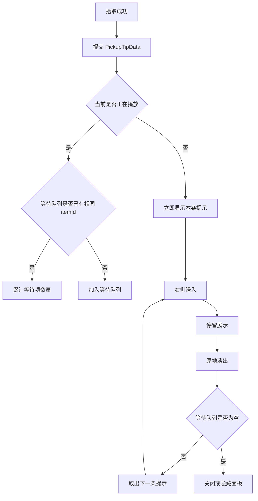

# 拾取成功提示 UI 面板设计文档

## 1. 目标与范围

本文档定义玩家拾取掉落物成功后的 UI 提示面板设计。目标是在战斗主界面中，用轻量、可排队、可合并的提示反馈玩家获得的道具信息。

本功能覆盖：

- 显示拾取物图标、名称、数量。
- 面板固定显示在屏幕右侧中部。
- 面板从屏幕右侧滑入，展示结束后原地淡出。
- 每条提示总展示时长固定为 4 秒。
- 多个拾取提示按顺序排队播放。
- 待展示队列中的相同道具按道具 ID 合并数量。
- 当前正在展示的提示不更新、不延时、不参与合并。
- 仅在游戏主界面 / 战斗 HUD 状态下显示。

暂不覆盖：

- 多条提示同时堆叠显示。
- 当前提示动态更新数量。
- 背包、暂停、设置等菜单打开时继续展示提示。
- 最终美术资源定稿和音效表现。

## 2. 用户确认规则

- 面板位置使用屏幕右侧中部。
- 相同道具允许合并，但只合并待展示队列中的道具。
- 当前正在展示的道具固定播放 4 秒，期间不会被新拾取的同类道具更新。
- 退场动效使用原地淡出，不滑回屏幕外。
- 打开背包、暂停菜单、设置菜单等非主界面状态时不显示拾取提示。

## 3. 推荐架构

采用“独立面板 + 队列状态”的方案，避免污染通用 Toast，也避免把拾取提示逻辑写入 `BattleHudPanel` 主逻辑。

建议新增或调整以下结构：

```text
Assets/Game/UI/Panels/PickupTipPanel.cs
Assets/Game/UI/Common/PickupTipData.cs
```

核心职责：

- `PickupTipPanel`：负责面板显示、排队、合并、播放时序和动效。
- `PickupTipData`：承载单条拾取提示所需数据，包括道具 ID、图标、名称、数量。
- 拾取成功逻辑：只负责在拾取成功后提交提示数据，不直接控制 UI 动画或 UI 生命周期。

## 4. 面板结构

面板结构参考用户提供的示意图，横向从左到右排列：

```text
[ 背景面板 ]
  ├── 图标区域：显示拾取物图标
  ├── 名称文本：显示拾取物名称
  └── 数量文本：显示 x数量，例如 x1、x5
```

布局建议：

- 根节点使用右侧中部锚点，便于不同分辨率下保持稳定位置。
- 背景面板使用横向条形布局。
- 图标区域保持固定尺寸，避免不同图标导致布局抖动。
- 名称文本允许适度截断或自适应，但不影响数量区域位置。
- 数量文本始终显示，包括数量为 1 的情况。

## 5. 播放流程

拾取提示播放流程如下：



关键规则：

- 当前提示播放中时，新拾取数据只能进入等待队列。
- 合并查找只扫描等待队列，不扫描当前播放项。
- 每条提示从开始滑入到淡出完成，总时长固定为 4 秒。
- 队列为空后，面板关闭或隐藏，等待下一次拾取触发。

## 6. 动效设计

建议将总时长 4 秒拆分为：

- 滑入：约 0.25 秒，从屏幕右侧外移动到右侧中部目标位置。
- 停留：约 3.2 秒，保持完全可见。
- 淡出：约 0.55 秒，位置不变，仅降低透明度。

实现要求：

- 使用 `RectTransform` 控制滑入位置。
- 使用 `CanvasGroup` 控制透明度。
- 淡出结束后重置透明度和位置，确保下一条提示从正确状态开始。
- 不依赖暂停菜单期间继续播放；非主界面状态下应停止或不触发显示。

## 7. 数据流

推荐数据流：

```text
掉落物拾取成功
  -> 生成 PickupTipData
  -> 打开或通知 PickupTipPanel
  -> PickupTipPanel 入队 / 合并
  -> PickupTipPanel 顺序播放 UI
```

`PickupTipData` 建议字段：

```text
ItemId      道具唯一 ID，用于合并判断
Icon        道具图标 Sprite
Name        道具显示名称
Count       本次拾取数量
```

合并必须以 `ItemId` 为准，不以名称为准，避免同名不同道具被错误合并。

## 8. 显示条件

面板只应在战斗主界面 / HUD 可见状态下显示。

建议规则：

- 战斗 HUD 可见且未打开阻塞型菜单时，允许播放拾取提示。
- 背包、暂停、设置等菜单打开时，不显示新提示。
- 如果菜单打开时发生拾取，可按实现接入成本选择“暂存到队列，回到 HUD 后播放”；默认推荐暂存，避免玩家错过拾取反馈。

## 9. 异常与边界

本功能遵循 fast fail 和单一真相原则，不做过度防御。

- 拾取逻辑应保证传入合法道具 ID、名称、图标和数量。
- 数量必须来自拾取结果，不由 UI 查询背包推断。
- 面板不负责修复配置缺失；道具配置缺失应在拾取数据组装处暴露问题。
- 图标为空属于配置问题，不在 UI 层吞掉异常。

## 10. 验证方式

实现完成后只做项目允许的验证：

- 使用 `$CLI compile unity` 验证 Unity 编译。
- 在 Unity 中检查单个道具拾取提示是否显示 4 秒并淡出。
- 连续拾取不同道具时，确认按顺序排队播放。
- 连续拾取相同道具时，确认等待队列中的数量合并。
- 当前展示同类道具期间再次拾取，确认当前面板不更新、不延时。
- 打开背包、暂停或设置菜单时，确认提示不直接显示。

不新增测试文件或测试代码。

