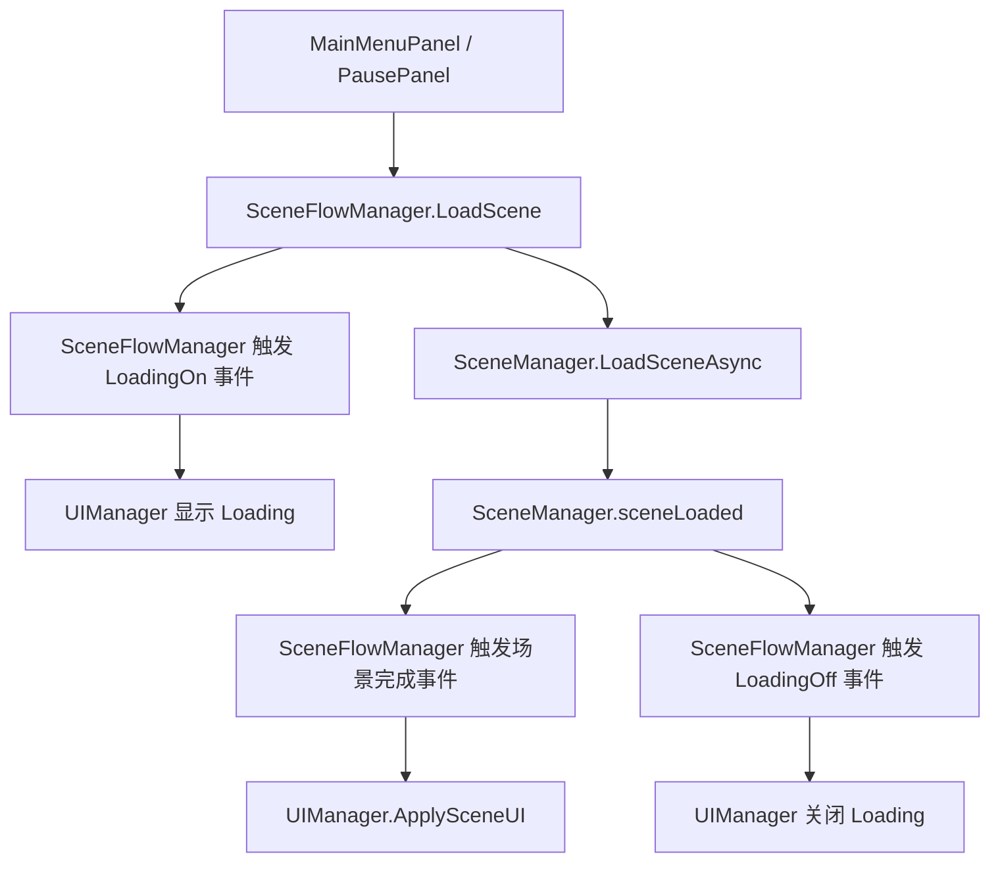

# 场景加载拆解设计文档

## 1. 目标与范围

把当前 `UIManager` 中的场景加载职责拆出去，让 `UIManager` 只保留 UI 响应职责，不再直接发起场景切换。

本次只处理场景加载链路，不改场景内容，不改 UI 视觉，不新增测试文件。

## 2. 当前问题

当前 `UIManager` 同时做了三类事情：

- 管理 UI 面板生命周期
- 监听场景切换并切换默认 UI
- 主动发起场景加载

这会导致 `UIManager` 既像 UI 管理器，又像场景流程管理器，职责混在一起。

现有入口主要是：

- `Assets/Game/UI/Panels/MainMenuPanel.cs`
- `Assets/Game/UI/Panels/PausePanel.cs`
- `Assets/Game/UI/Bag/BagPanel.cs`
- `Assets/Game/UI/Core/UIManager.cs`

## 3. 方案

新增一个独立的场景流程管理器 `SceneFlowManager`，专门负责：

- 发起场景加载
- 返回主菜单
- 监听 Unity 场景加载完成
- 对外发布场景加载状态和场景切换结果

同时新增一个纯常量类 `SceneNames`，统一保存场景名：

- `MenuScene`
- `Scene1`

这样 `MainMenuPanel`、`PausePanel`、`BagPanel` 里的场景字符串都不再散落在各处。

## 4. 组件职责

### 4.1 `SceneFlowManager`

职责：

- 提供 `LoadScene(string sceneName)`
- 提供 `ReturnToMainMenu()`
- 持有场景加载协程
- 调用 `SceneManager.LoadSceneAsync`
- 监听 `SceneManager.sceneLoaded`
- 通过事件通知 UI 层当前是否在加载、加载是否失败、场景已经切换完成

不负责：

- 创建或控制 UI 面板
- 显示 loading 面板
- 显示 toast

### 4.2 `UIManager`

职责：

- 管理 UI 面板
- 根据场景变化打开 `MainMenuPanel` / `BattleHudPanel`
- 显示和关闭 loading 面板
- 显示 toast
- 控制鼠标锁定

不再负责：

- `SceneManager.LoadSceneAsync`
- `ReturnToMainMenu`
- 场景名常量

### 4.3 `SceneNames`

职责：

- 只放场景名常量
- 给 `SceneFlowManager`、`UIManager`、`UIShortcut` 属性共用

## 5. 数据流

加载流程：

1. 面板调用 `SceneFlowManager`。
2. `SceneFlowManager` 发起 Unity 场景切换。
3. `SceneFlowManager` 发布“正在加载”状态。
4. `UIManager` 打开 loading 面板。
5. 场景完成后，`SceneFlowManager` 通知 UI 层。
6. `UIManager` 按场景名切默认 UI。
7. `UIManager` 关闭 loading 面板。

## 6. 文件拆分

拟调整文件：

- `Assets/Game/Scene/SceneNames.cs`
- `Assets/Game/Scene/SceneFlowManager.cs`
- `Assets/Game/UI/Core/UIManager.cs`
- `Assets/Game/UI/Panels/MainMenuPanel.cs`
- `Assets/Game/UI/Panels/PausePanel.cs`
- `Assets/Game/UI/Bag/BagPanel.cs`

## 7. 迁移步骤

1. 新增 `SceneNames`，把 `MenuScene` 和 `Scene1` 收口。
2. 新增 `SceneFlowManager`，搬走场景加载协程和返回菜单入口。
3. `UIManager` 删除场景加载相关字段、方法和 Unity 场景监听。
4. `UIManager` 改为订阅 `SceneFlowManager` 的加载状态和场景完成事件。
5. `MainMenuPanel`、`PausePanel`、`BagPanel` 改为调用新管理器和新常量。
6. 保持现有加载遮罩、主菜单/HUD 切换、退出游戏行为不变。

## 8. 约束与风险

- `UIManager` 仍然保留 loading 面板能力，但不再主动驱动场景加载。
- 场景切换时必须确保事件解绑，避免重复订阅。
- 场景加载失败时要保证 loading 能被关闭。
- 不能改 `.controller` 文件。
- 不新增测试文件。

## 9. 验收标准

- `UIManager` 中不再出现 `SceneManager.LoadSceneAsync`。
- `MainMenuPanel` 的开始游戏按钮不再调用 `UIManager.LoadScene`。
- `PausePanel` 的返回主菜单按钮不再调用 `UIManager.ReturnToMainMenu`。
- `BagPanel`、`PausePanel` 等处的场景名改为统一常量。
- 菜单场景进入后仍自动打开主菜单，战斗场景进入后仍自动打开战斗 HUD。
